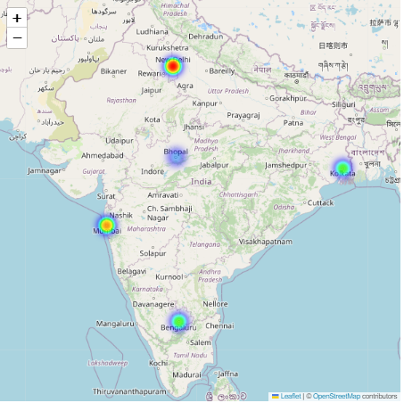

# Project3-EDA
> **Brief Description:** - Display the distribution of dengue cases across specific cities or regions in India. This visualizes the geographic spread and intensity of outbreaks. This map is known as Heat Map.

---

## Table of Contents

- [Description](#description)
- [Video Explanation](#video)
- [Technologies Used](#technologies-used)
- [Dataset](#dataset)
- [Program Codes ](#program-codes)
- [Screenshots](#screenshots)
- [Contribution](#contributipn)
- [Contact Details](#contact-details)

---

## Description

Display the distribution of dengue cases across different cities in India. This visualizes the geographic spread and intensity of outbreaks.

## Video
<!--
 
-->

We are working on this section. Please check at some other time.

## Technologies-used

Python programming language, pandas, folium, IPython and geopandas package.

## Dataset

The dataset has been generated by another program. However, it is recommended that for real life analysis actual data should be collected and processed properly to get realistic results.

## Program-codes

The programs are written on jupiter notebook, You may run the program on Google colab by clicking on the colab badge below. However, the output may not be generated on colab. For that you have to download the program and run it locally. Make sure that the packages are all installed.

## Screenshots

**This program creates a heatmap to visualize the concentration of dengue cases across different regions in India. Here are the key points and what can be learned from the output:**

- **Geographical Hotspots:**

  - The heatmap highlights regions with higher concentrations of dengue cases. Areas with more intense colors (typically red) indicate higher numbers of cases.
  
- **Regional Comparison:**

  - By visualizing the data on a heatmap, it's easy to compare the relative burden of dengue between different regions of India, such as North, South, East, West, and Central.
  
- **Data Aggregation:**

  - The data is aggregated to show the total number of cases and deaths per region. This helps in understanding the overall impact of dengue in each region.
  
- **Visual Representation:**

  - The heatmap provides an intuitive visual representation of the data, making it easier for non-technical stakeholders to understand the severity and spread of dengue.
  
- **Regional Coordinates:**

  - The program uses hypothetical coordinates for major cities within each region to place the heat points on the map. This can be customized with actual coordinates for more precise mapping.
  
- **Interactive Exploration:**

  - The resulting map is interactive, allowing users to zoom in and out and pan around to explore different parts of the country. This can provide deeper insights into specific areas.

- **Resource Allocation:**

  - Public health officials can use this map to identify regions that require more resources and attention for dengue prevention and control measures.

- **Temporal Analysis:**

  - Although this specific map does not include temporal data, it can be extended to show changes over time by creating a series of heatmaps for different time periods.

In summary, this heatmap helps identify and compare the intensity of dengue outbreaks across different regions in India, providing a valuable tool for public health planning and resource allocation.

## Contribution

The programs are written by Santanu Karmakar

## Contact-details

If you wish to contact me, please leave a message (Preferably WhatsApp) on this number: 6291 894 897.
Please also mention why you are contacting me. Include your name and necessary details.
Thank you for taking an interest.
